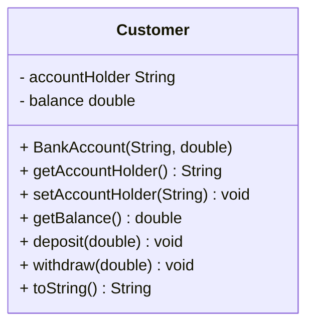
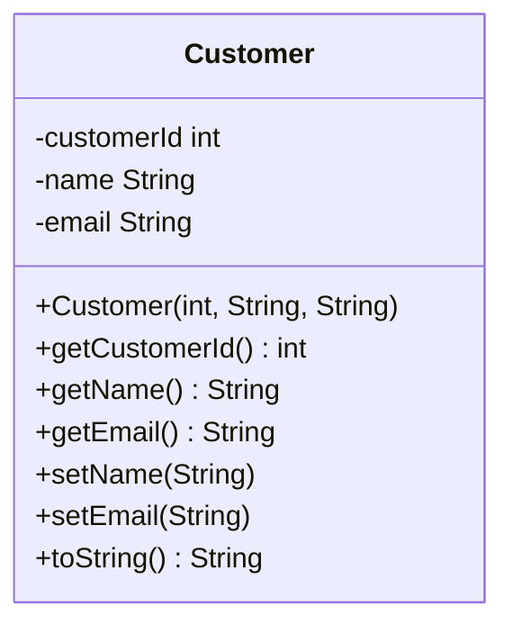
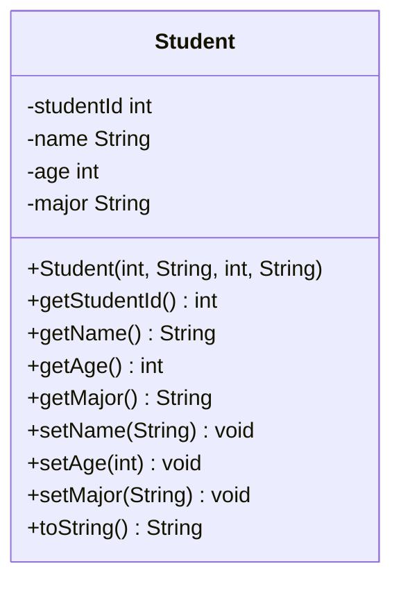
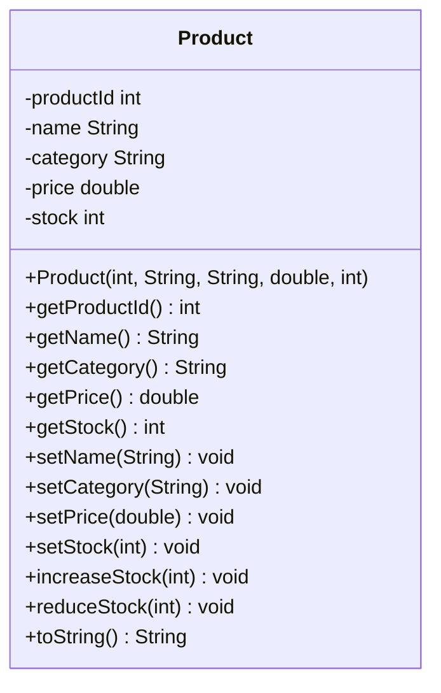
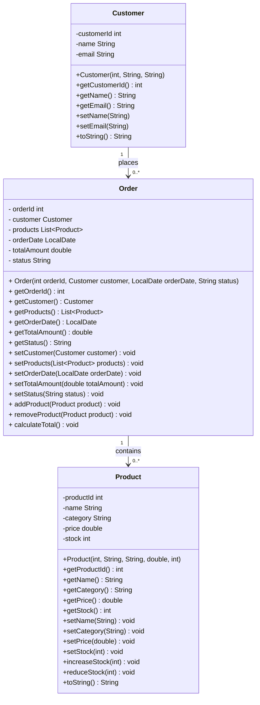

# Java OOP Concepts Exercises : Answers

## 🛠  How to Run :
1. Clone the Repository
    ```bash
    git clone https://github.com/jayani-athukorala/java-oop-exercise.git
    ```
2. Open the project in preferred IDE.
3. Buld and Run ```Main.java```

---

## 📌 Exercise Document

You can find the exercise description here:

[Exercise Document](OOP1_Exercises.md)

---

## 🧱 UML Class Diagrams

### Exercise 1 : 'BankAccount' Class UML



### Exercise 2 : 'Customer' class UML



### Exercise 3 : 'Student' class UML



### Exercise 4 : 'Product' class UML



### Exercise 5 : 'Order' class UML



---
## ⚡ Expected Output :

```
========== Exercise 1 ===========
BankAccount{accountHolder='Jayani Athukorala', balance=10700.0}
BankAccount{accountHolder='Kristy Heijenk', balance=19550.0}
AccountHolder: Fadi Alaraj, Balance: 26500.0

========== Exercise 2 ===========
Customer{customerId=111101, name='Jayani Athukorala', email='jayani@email.com'}
Customer{customerId=111102, name='Kristy Heijenk', email='kristy.new@email.com'}
Customer{customerId=111103, name='Fadi Alaraj', email='fadi@email.com'}

========== Exercise 3 ===========
Student{studentId=101, name='Sakuni Satharasinghe', age=20, major='Software Engineering'}
Student{studentId=102, name='Mazood Imitiyaz', age=22, major='Mathematics'}
Student{studentId=102, name='Kalhara Nipunsara', age=22, major='Computer Networking'}

========== Exercise 4 ===========
Product{productId=101, name='Shampoo', category='HairCare', price=199.99, stock=45}
Product{productId=102, name='Conditioner', category='HairCare', price=190.49, stock=40}
Product{productId=103, name='Hair Oil', category='HairCare', price=125.99, stock=30}
Product{productId=201, name='Moisturizer', category='SkinCare', price=249.99, stock=60}
Product{productId=202, name='Face Wash', category='SkinCare', price=7.99, stock=70}
Product{productId=203, name='Sunscreen', category='SkinCare', price=229.49, stock=45}

========== Exercise 5 ===========
Order{orderId=1001, customer=Customer{customerId=111101, name='Jayani Athukorala', email='jayani@email.com'}
, products=[Product{productId=101, name='Shampoo', category='HairCare', price=199.99, stock=44}
, Product{productId=201, name='Moisturizer', category='SkinCare', price=249.99, stock=58}
], orderDate=2026-03-18, totalAmount=449.98, status='Delivered'}
Order{orderId=1002, customer=Customer{customerId=111102, name='Kristy Heijenk', email='kristy.new@email.com'}
, products=[Product{productId=102, name='Conditioner', category='HairCare', price=190.49, stock=39}
, Product{productId=201, name='Moisturizer', category='SkinCare', price=249.99, stock=58}
, Product{productId=203, name='Sunscreen', category='SkinCare', price=229.49, stock=44}
], orderDate=2026-03-18, totalAmount=669.97, status='Pending'}

```
---